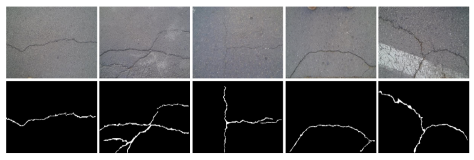
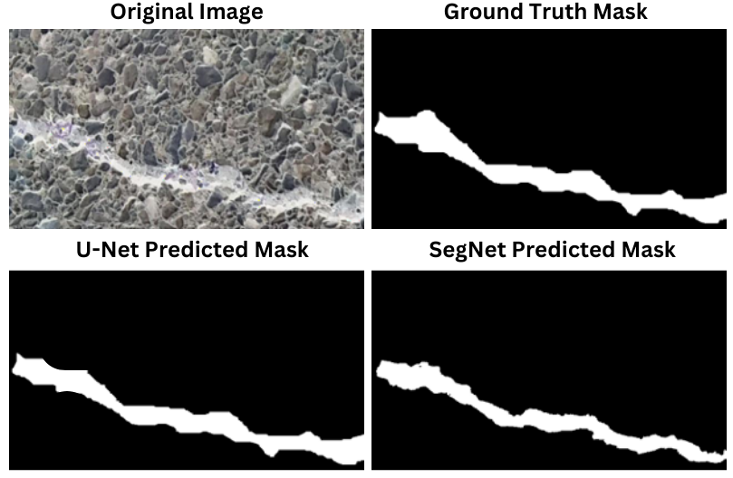

# Pavement_crack_detect
Pavement crack detection is a critical task in road infrastructure management to ensure safety and longevity and is critical to enable autonomous driving. Traditionally, this process has been conducted manually, making it time-consuming and error-prone. In this work, semantic segmentation was employed to automate crack detection, utilizing U-Net and SegNet on the Crack500 dataset.

Crack500 dataset [1]: The RGB image (Input) and Segmented Image (Desired Output) respectively.

Pavement Crack detection result example: 

[1]	Ran, R., Xu, X., Qiu, S., Cui, X. and Wu, F., 2021, October. Crack-SegNet: Surface Crack Detection in Complex Background Using Encoder-Decoder Architecture. In 2021 4th International Conference on Sensors, Signal and Image Processing (pp. 15-22). 

